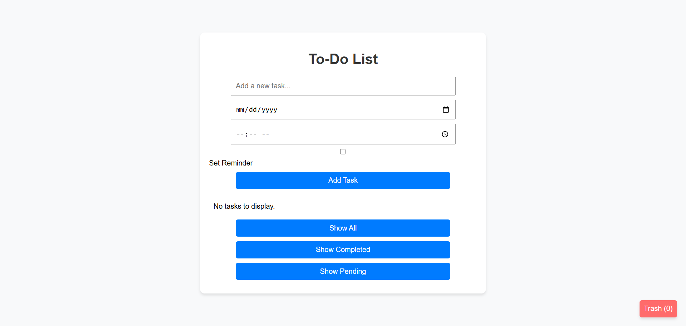

# To-Do App pure Javascript
## Notes:
# ScreenShot!

*  when a task is marked as deleted, it's not being visually displayed because we're excluding it from the filtered task list when it's deleted (if (task.deleted) return;). This is why it disappears entirely after being marked as deleted.

* To fix this, instead of excluding deleted tasks from the render function entirely, we should just visually mark them as deleted (for example, by adding a "deleted" class or changing the appearance) while still keeping them in the task list. This way, they can still be restored, but they won't be removed completely.

### The issue of shown deleted cards of tasks under displaying new ones, has been addressed with the following key points in the code update:

* Separation of Deleted Tasks: Deleted tasks are now moved to a deletedTasks array instead of remaining mixed with active tasks.

* Trash Bin Integration: Clicking the trash bin icon (#trash-bin-icon) shows deleted tasks by rendering them from deletedTasks.

* Trash Bin Management:
- Restoring tasks moves them back to tasks and removes them from deletedTasks.
- Permanently deleting tasks removes them from deletedTasks.
* Persistent Storage: Both tasks and deletedTasks are stored in localStorage, ensuring data persists across sessions.
Dynamic Trash Bin Icon Update: 
* The trash bin icon dynamically updates with the count of deleted tasks.
**How It Works**:

- When a task is deleted, it is marked as deleted, moved to the deletedTasks array, and removed from tasks.
- The trash bin (#trash-container) shows the deleted tasks with options to restore or permanently delete.
- Tasks restored from the trash are returned to the main tasks list, allowing them to reappear based on the current filter.
- Permanently deleted tasks are removed entirely from the application.